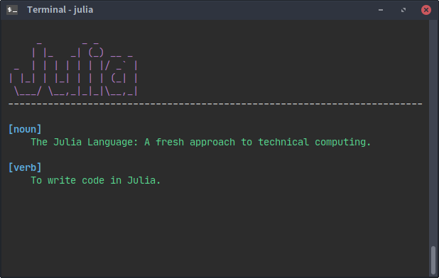
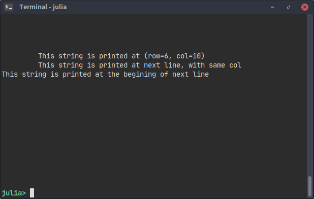
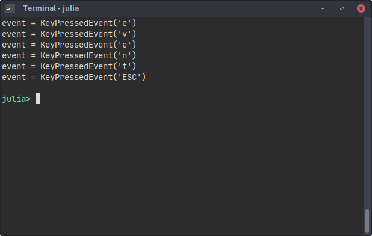
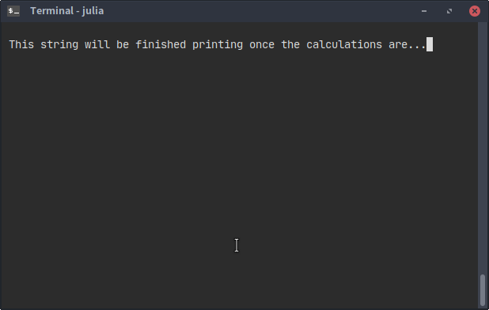
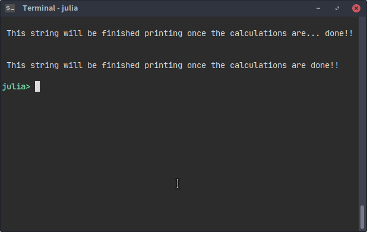

<h1 align="center">
    
    <br>
</h1>

| **Build Status**                                              |
|:-------------------------------------------------------------:|
| [![][travis-img]][travis-url] [![][codecov-img]][codecov-url] |

[travis-img]: https://travis-ci.com/foldfelis/Terming.jl.svg?branch=master

[travis-url]: https://travis-ci.com/github/foldfelis/Terming.jl

[codecov-img]: https://codecov.io/gh/foldfelis/Terming.jl/branch/master/graph/badge.svg

[codecov-url]: https://codecov.io/gh/foldfelis/Terming.jl

# Terming.jl

Terming is a toolbox for manipulate terminals written in pure Julia. It offers low-level and elegant APIs to handle information directly from and work around with TTYs.

To its simplicity, Terming provides high coverage of essential ANSI terminal methods that allows developers to focus on their features without bother communicating with terminals. In short, Terming handles like a dream.

For more high-level functionality, please check out [DisplayStructure.jl](https://github.com/foldfelis/DisplayStructure.jl), which uses Terming as backend.

## Quick start

The package can be installed with the Julia package manager.
From the Julia REPL, type `]` to enter the Pkg REPL mode and run:

```julia
pkg> add Terming
```

## Features

### **Cursor movement and Console size**

```julia
using Terming

function main()
    # set term size and clear
    Terming.displaysize(20, 75); Terming.clear()
    # move cursor to (row=6, col=10)
    Terming.cmove(6, 10)
    # save current position
    Terming.csave()
    Terming.print("This string is printed at (row=6, col=10)")
    # restore saved position
    Terming.crestore()
    # move cursor down
    Terming.cmove_down()
    Terming.print("This string is printed at next line, with same col")
    # move cursor to the beginning of next line
    Terming.cmove_line_down()
    Terming.print("This string is printed at the beginning of next line")
    # move cursor to last line
    Terming.cmove_line_last()

    return
end

main()
```



### **Raw mode and Special keys events**

```julia
using Terming

function main()
    # set term size and clear
    Terming.displaysize(20, 75); Terming.clear()

    # enable raw mode
    Terming.raw!(true)
    event = nothing
    while event != Terming.KeyPressedEvent(Terming.ESC)
        # read in_stream
        sequence = Terming.read_stream()
        # parse in_stream sequence to event
        event = Terming.parse_sequence(sequence)
        @show event
    end
    # disable raw mode
    Terming.raw!(false)

    return
end

main()
```



### **Buffered**

```julia
using Terming

function main()
    # set term size and clear
    Terming.displaysize(20, 75); Terming.clear()
    # move cursor to (row=2, col=2)
    Terming.cmove(2, 2)

    # +----------------+
    # | without buffer |
    # +----------------+
    str = "This string will be finished printing once the calculations are..."
    Terming.print(str)
    sleep(1) # fake time consuming calculation
    Terming.println(" done!!")

    # move cursor to the beginning of next two line; move to col=2
    Terming.cmove_line_down(2); Terming.cmove_col(2)

    # +-------------+
    # | with buffer |
    # +-------------+
    Terming.buffered() do buffer
        str = "This string will be finished printing once the calculations are"
        Terming.print(buffer, str)
        sleep(1) # fake time consuming calculation
        Terming.println(buffer, " done!!")
    end

    return
end

main()
```





### **Looking for color screen?**

It is recommended to use [Crayons](https://github.com/KristofferC/Crayons.jl) to gain more decorations. [Here](example/features/logo.jl) and [here](example/snake/view.jl) are some examples

## Want something more advanced?

For a more complete example, take a look at [Snake Game](example/snake).
