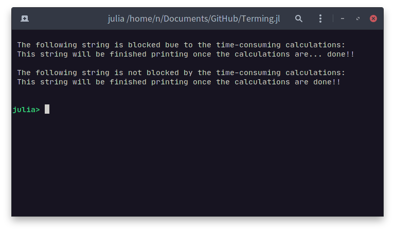

<h1 align="center">
    
    <br>
</h1>

| **Build Status**                                 |
|:------------------------------------------------:|
| ![CI][github-ci] [![][codecov-img]][codecov-url] |

[github-ci]: https://github.com/foldfelis/Terming.jl/workflows/CI/badge.svg

[codecov-img]: https://codecov.io/gh/foldfelis/Terming.jl/branch/master/graph/badge.svg

[codecov-url]: https://codecov.io/gh/foldfelis/Terming.jl

# Terming.jl

Terming is a toolbox for manipulate terminals written in pure Julia. It offers low-level and elegant APIs to handle information directly from and work around with TTYs.

To its simplicity, Terming provides high coverage of essential ANSI terminal methods that allows developers to focus on their features without bother communicating with terminals. In short, Terming handles like a dream.

For more high-level functionality, please check out [DisplayStructure.jl](https://github.com/foldfelis/DisplayStructure.jl), which uses Terming as backend.

## Quick start

The package can be installed with the Julia package manager.
From the Julia REPL, type `]` to enter the Pkg REPL mode and run:

```julia
pkg> add Terming
```

## Features

### **Cursor movement and Console size**

<details>

```julia
using Terming

function main()
    # set term size and clear
    Terming.displaysize(20, 75); Terming.clear()
    # move cursor to (row=6, col=10)
    Terming.cmove(6, 10)
    # save current position
    Terming.csave()
    Terming.print("This string is printed at (row=6, col=10)")
    # restore saved position
    Terming.crestore()
    # move cursor down
    Terming.cmove_down()
    Terming.print("This string is printed at next line, with same col")
    # move cursor to the beginning of next line
    Terming.cmove_line_down()
    Terming.print("This string is printed at the beginning of next line")
    # move cursor to last line
    Terming.cmove_line_last()

    return
end

main()
```


</details>

### **Raw mode and Special keys events**

<details>

```julia
using Terming

function main()
    # set term size and clear
    Terming.displaysize(20, 75); Terming.clear()

    # enable raw mode
    Terming.raw!(true)
    event = nothing
    while event != Terming.KeyPressedEvent(Terming.ESC)
        # read in_stream
        sequence = Terming.read_stream()
        # parse in_stream sequence to event
        event = Terming.parse_sequence(sequence)
        @show event
    end
    # disable raw mode
    Terming.raw!(false)

    return
end

main()
```


</details>

### **Buffered**

<details>

```julia
using Terming

function println_animation(str::String; delay::Real=0.05)
    # save current position of cursor
    Terming.csave()

    for c in str
        Terming.print(c)
        sleep(delay)
        delay *= 0.98
    end

    # restore position of cursor and move down
    Terming.crestore(); Terming.cmove_down()
end

function main()
    # set term size and clear
    Terming.displaysize(20, 80); Terming.clear()
    # move cursor to (row=2, col=2)
    Terming.cmove(2, 2)

    # +----------------+
    # | without buffer |
    # +----------------+
    discription = "The following string is blocked bue to the time-consuming calculations:"
    println_animation(discription)

    # save current position of cursor
    Terming.csave()

    str = "This string will be finished printing once the calculations are..."
    Terming.print(str)
    sleep(1) # fake time consuming calculation
    Terming.println(" done!!")

    # restore position of cursor and move down 2 row
    Terming.crestore(); Terming.cmove_down(2)

    # +-------------+
    # | with buffer |
    # +-------------+
    discription = "The following string is not blocked by the time-consuming calculations:"
    println_animation(discription)

    # save current position of cursor
    Terming.csave()

    Terming.buffered() do buffer
        str = "This string will be finished printing once the calculations are"
        Terming.print(buffer, str)
        sleep(1) # fake time consuming calculation
        Terming.println(buffer, " done!!")
    end

    # restore position of cursor and move down 2 row
    Terming.crestore(); Terming.cmove_down(2)

    return
end

main()
```




</details>

### **Alternate screen mode**

<details>

```julia
using Terming

function main()
    # set term size
    Terming.displaysize(20, 75)
    # switch to alternate screen
    Terming.alt_screen(true)

    Terming.cmove(1, 1)
    Terming.println("Terminal is now switched to the alternate screen mode.")
    Terming.println("Press ENTER to switch back."); readline()

    # switch back from alternate screen
    Terming.alt_screen(false)

    return
end

main()
```


</details>


### **Looking for color screen?**

It is recommended to use [Crayons](https://github.com/KristofferC/Crayons.jl) to gain more decorations.

You will find it entertaining to take a look at how I design the logo [here](example/logo.jl). And as well as how I render a snake game [here](https://github.com/foldfelis/Snake.jl/blob/master/src/view.jl).

## Want something more advanced?

For a more complete example, take a look at [Snake Game](https://github.com/foldfelis/Snake.jl).

## State of supporting Windows

Windows default Powershell and command line emulators are two of the most popular terminal emulators among Windows users though, it is recommended to use [Windows' new terminal emulator](https://github.com/microsoft/terminal) so as to have more colorful and highly customizable experience.

Currently, Terming.jl supports Windows, yet some features may behave abnormally such as:

* Change terminal size: `displaysize(::Int, ::Int)`
* Alternate screen mode: `alt_screen(::Bool)`
* `BackTab` determination
