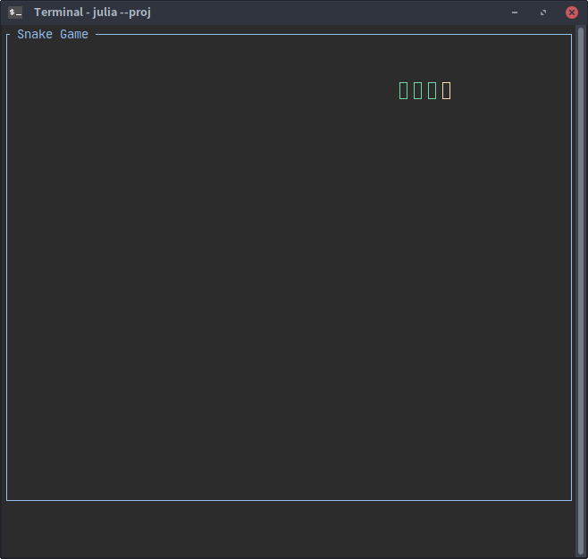

<h1 align="center">
    
    <br>
</h1>

# Snake Game

This snake game demonstrates how to build an application using Terming as backend.

## Quick start

1. [Install Terming.jl](https://github.com/foldfelis/Terming.jl#quick-start)
2. Install [Crayons.jl](https://github.com/KristofferC/Crayons.jl)
3. Clone the repository
4. Run the main script
```julia
julia> include("Terming.jl-master/example/snake/main.jl")
```

## How to play

Use `Up`, `Down`, `Right` and `Left` key to control snake movement, press `ESC` to quit.
